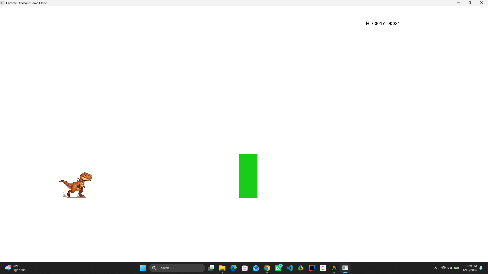

# 🦖 Chrome Dinosaur Game Clone

A modern 2D clone of the classic Google Chrome Dinosaur Game (T-Rex Runner) built in **C++** using **OpenGL** via **FreeGLUT**. 



---

## 🎮 How to Play

### Objectives
* **Survive:** Dodge the oncoming cacti as they spawn procedurally.
* **Score:** Your score increases over time. Survival is key!
* **High Score:** Challenge yourself to beat your High Score (HI) shown on the top right.
* **Speed Scaling:** The game speed increases every 100 points, making it more challenging the longer you survive.

### Controls
| Key | Action |
|:---|:---|
| **`ENTER`** | Start the Game / Restart the Game (after Game Over) |
| **`UP ARROW`** | Jump to dodge low-lying obstacles |
| **`DOWN ARROW`** | Duck (Press and hold) to shrink the dinosaur's hitbox |
| **`LEFT ARROW`** | Move Left (allows active horizontal positioning) |
| **`RIGHT ARROW`** | Move Right (allows active horizontal positioning) |
| **`SPACE`** | Pause / Resume the game |
| **`ESC`** | Quit the application |

---

## 🛠️ Project Structure
The codebase is structured modularly to allow parallel development and testing:
* [Constants.h](file:///d:/PROJECTS/TrexRun/Constants.h) — Contains window dimension, physics constants (gravity, jump strength), and ground levels.
* [Dino.h](file:///d:/PROJECTS/TrexRun/Dino.h) & [Dino.cpp](file:///d:/PROJECTS/TrexRun/Dino.cpp) — Handles player physics (jumping, ducking, movement), texture/animation updates, and state.
* [Obstacles.h](file:///d:/PROJECTS/TrexRun/Obstacles.h) & [Obstacles.cpp](file:///d:/PROJECTS/TrexRun/Obstacles.cpp) — Controls procedural generation, movement speed, and rendering of the cacti.
* [main.cpp](file:///d:/PROJECTS/TrexRun/main.cpp) — Sets up the OpenGL viewport, registers callback handlers, implements the main game loop, and handles collision detection.

---

## 📋 Prerequisites
To build and run this project, make sure you have:
1. **Operating System:** Windows.
2. **C++ Compiler:** GCC/MinGW `g++` compiler installed. Make sure it is added to your system's `PATH`.
3. **PowerShell:** Required for running the automated build script.
4. **OpenGL & FreeGLUT:**
   * OpenGL is natively supported by Windows.
   * FreeGLUT header files and precompiled binaries are **included directly in this repository** under the `freeglut/` folder, so no manual external configuration or download is required!

---

## 🚀 How to Build and Run

### Option 1: Automated Script (Recommended)
We provide a PowerShell script [build_and_run.ps1](file:///d:/PROJECTS/TrexRun/build_and_run.ps1) that copies the required DLL file, compiles the source code, links the OpenGL/FreeGLUT libraries, and runs the application automatically.

1. Open a **PowerShell** terminal in the project directory.
2. Run the script:
   ```powershell
   .\build_and_run.ps1
   ```

### Option 2: Manual Compilation via Command Line
If you prefer to compile manually using MinGW `g++`:

1. Ensure the `libfreeglut.dll` file is present in the root directory (copied from `.\freeglut\freeglut\bin\libfreeglut.dll`).
2. Run the compiler command from the root directory:
   ```cmd
   g++ main.cpp Dino.cpp Obstacles.cpp -o DinosaurGame.exe -I.\freeglut\freeglut\include -L.\freeglut\freeglut\lib -lfreeglut -lglu32 -lopengl32
   ```
3. Run the compiled executable:
   ```cmd
   .\DinosaurGame.exe
   ```

### Option 3: CMake Build
A [CMakeLists.txt](file:///d:/PROJECTS/TrexRun/CMakeLists.txt) is provided for systems that support CMake builds. Ensure that your CMake configuration can resolve standard OpenGL and GLUT packages.

